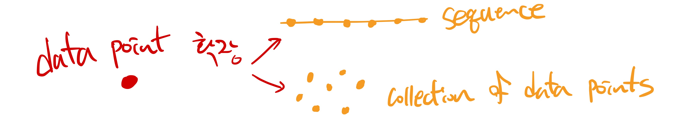
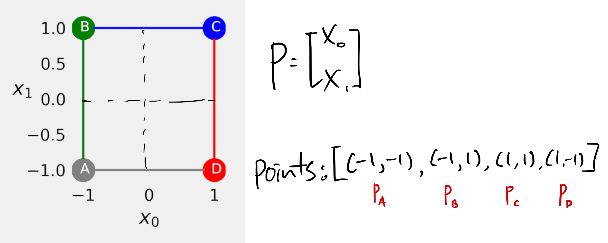
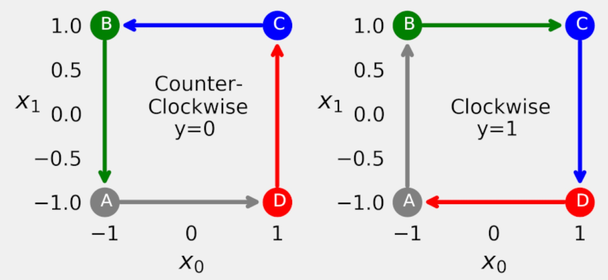
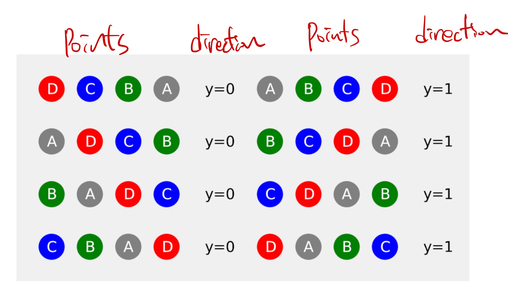
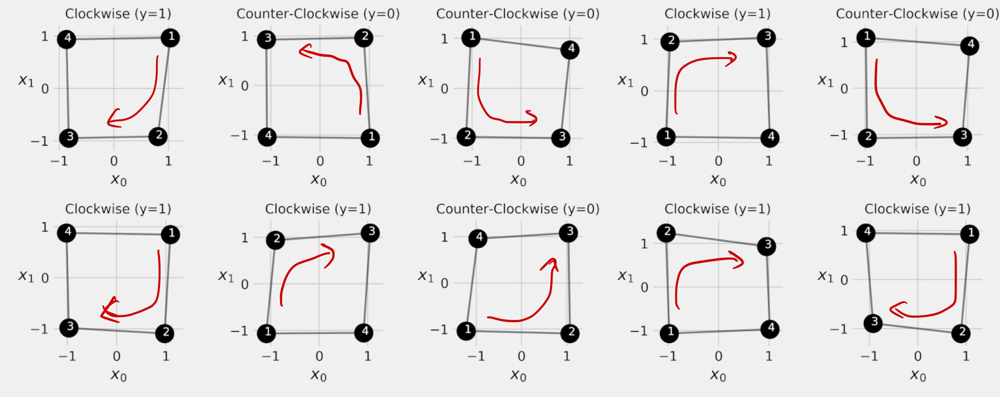

# (1) Sequences 개념 정리

## Coverage

- characteristics of **sequential data** and generate our own
- understand the **inner workings** of **recurrent layers** (순환 계층의 내부적 동작방법 이해)
- build and train models to perform **classification** of **sequences**
- understand the importance of the **hidden state** as the **representation of a sequence** (시퀀스 데이터를 벡터로 표현하기 위한 hidden state)
- visualize the **journey of a hidden state** from beginning
- preprocess **variable-length sequences** using **padding** and **packing** techniques, and the **collate function**
- how **1D convolutions** can be used on **sequential data**?

---

## Sequences

### **[1] 개념 및 용어 정리**

Q) “Sequence” 와 단순 “collection of data points”의 차이점을 설명하시오. 

A) 가장 큰 차이점은 수집한 data points에 **순서**가 있는지 여부다. 

- **ordered collection** of data points ⇒ sequence
- **non-ordered** collection ⇒ non-sequence



Q) “**point-level** 레이블(label)"과 “**sequence-level** 레이블" 간의 차이를 설명하시오. 

A) data point 별로 단일 레이블(single label)을 할당하는지와 관련돼 있다

- data point 별로 단일 레이블 할당 ⇒ point-level label
- If an ordered sequence of data points shares a single label ⇒ sequence-level label

ex1) 고양이와 강아지 이미지를 분류하기 위한 DB의 경우 이미지 별로 레이블이 할당된다; 

- image-level annotation (*i.e.*, point-level)

ex2) Video action recognition DB의 경우 t 초 짜리 동영상 개별로 행동 레이블이 할당된다; 

- video-level annotation *(i.e.*, sequence-level)

Q) “Why is ***ordered*** so important?” explain by using greyscale images with *shuffled pixels*.

A) 이미지는 픽셀 포인트(pixel points)가 일련의 순서로 배치된 데이터로 볼 수 있다. 

- 즉, 이미지 데이터의 구성 = the collection of ordered pixels
- 하나의 픽셀은 single data-point 이고, 픽셀 별로 단일 값을 가지며 보통 `uint8` 자료형을 가진다.
- 이미지 레이블은 픽셀 별로 할당되지 않는다. 즉, 이미지 데이터에서 개별 픽셀 값은 의미를 가지지 않는다.
- 이미지 데이터가 의미를 가지는 이유은 픽셀 값들이 일련의 순서로 배치될 때 나오는 **형상**(appearance)과 **공간 정보**(spatial information) 때문이다. 즉, **순서** 때문에 의미를 가지게 된다.
- 따라서, 수집된 data points를 어떤 순서로 배치하느냐에 따라 의미가 달라지는 데이터 유형은 **순서** 정보 또한 중요하다

Q) **RNN**s 모델은 sequence problem 을 해결하기 위해 주로 활용된다. 2D 이미지 데이터를 **RNN**s 모델로 처리할 수 있는가? 가능하다면 그 방법은 무엇인가? 

A) 가능하다. 2D 이미지를 일련의 순서가 있는 1D 시퀀스로 표현하면 된다. 


- 주어진 2D 이미지가 단일 채널일 경우 1차원 벡터 형태로 펼칠 수 있다(flatten)
- 이는 순서가 있는 sequence 이기 때문에 RNNs 모델을 적용할 수 있다

※ 또한, **시퀀스** 데이터는  **1D convolution**으로 처리가 가능하다 

- “음성 신호처리” 에서 1D convolution을 적용하듯
- 음성 신호 또한 ordered signals 이다

### **[2]** **Sequence Dataset Generation; 간단한 예시**

시쿼스 데이터를 분류(classification)하는 예시 문제를 만들어보자. 

**Data point**는 **vector**로 표현할 수 있다. 2D vector라면 2차원 평면에 이미지로 시각화 시킬 수 있다. 만약, [한 붓 그리기](https://www.google.com/search?q=%ED%95%9C%EB%B6%93%EA%B7%B8%EB%A6%AC%EA%B8%B0+%EC%95%8C%EA%B3%A0%EB%A6%AC%EC%A6%98&rlz=1C5CHFA_enKR953KR953&oq=%ED%95%9C%EB%B6%93&aqs=chrome.2.69i57j0i512l2j46i512j0i512l6.3996j0j1&sourceid=chrome&ie=UTF-8) 처럼 순서대로 **네 개의 포인트**를 생성한다면 우리는 평면상에 **정사각형(square)**을 표현 할 수 있다.  



예를들어, 위의 그림 처럼 $P_{A}=(-1,-1)$, $P_{B}=(-1,1)$, $P_{C}=(1,1)$, $P_{D}=(1,-1)$ 순서로 포인트(**sequence of data points**)를 생성하면 완벽한 정사각형(perfect square)을 그릴 수 있다. 

- 또한, 생성되는 포인트의 **순서**에 따라서 한 붓 그리기의 방향이 **clockwise**(CW) 인지 **counterclockwise**(CCW) 가 결정된다.



Drawing directions 

Q) 한 붓그리기로 그려진 사각형이 ‘**그려지는 시작점**'과 ‘**그려지는 방향**’에 따라 다른 사각형이라고 했을 때, 그릴 수 있는 총 사각형의 개수는? 

A) $시작점의 개수 \times 방향 = 4 \times 2 = 8$

다음으로, CW 방향으로 생성된 사각형에  $y=1$, 반대로 CCW 방향으로 생성된 사각형에는 $y=0$ 으로 레이블을 할당하자. 그렇다면, 생성된 8가지의 사각형은 다음과 같은 레이블을 갖는다. 



Possible sequences of corners 

- 즉, 사각형의 모퉁이(=corners)가 나열되는 순서에 따라서 그려지는 방향이 결정된다.

 

각 코너점에 노이즈(noise)를 섞으면 무수히 많은 사각형을 생성할 수 있다 (*e.g.*, $P_{A}+\mathbb{\epsilon}$).  

만약, 128 random noisy squares 생성하는 코드를 작성한다면 아래와 같을 것이다:

```python
points, directions = generate_pointSeq(n=128, seed=13) #(사각형 생성 개수, 노이즈 시드)
```



Sequence dataset 

이렇게 생성된 데이터는 다음과 같은 자료구조를 갖는다: 

```python
points = [[Pc,Pd,Pa,Pb],  # P = (x0, x1)
					[Pd,Pc,Pb,Pa], 
           ...
          ]   # shape:=(128, 4, 2)
 
directions = [1, 0, ...] # shape:=(128,)  
```

우리가 설계하려는 문제는 일련의 시퀀스가 모델에 입력되고 ‘한 붓 그리기’로 사각형을 그렸을 때, 해당 사각형이 CW 방향으로 그려졌는지를 판단하는 **이진 분류**(binary classification) 문제이다:

$S:[p_{0},p_{1},p_{2},p_{3}] \rarr (0,1) \in \mathbb{R}$ , where $p_{i}\in \mathbb{R}^{2}$

**정리**: 위와 같이 ***Seq-to-vec*** 형태로 디자인된 문제를 풀기 위해 RNNs이 유용하다고 알려져 있다*.* 다음 섹션에서는 RNNs의 동작 원리를 정리한다

---

## Summary

- Sequence 와  단순 collection of data points의 차이점은 무엇인가
- image-level label  vs.  sequence-level label
- Ordered data가 왜 중요한가?
- Sequence data 생성하기 (예시 문제)

---

## Reference

[1] Deep Learning with PyTorch Step-by-Step